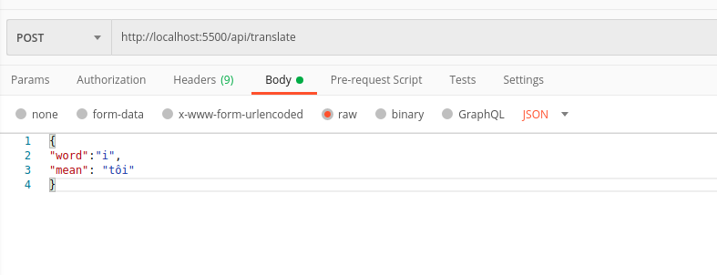
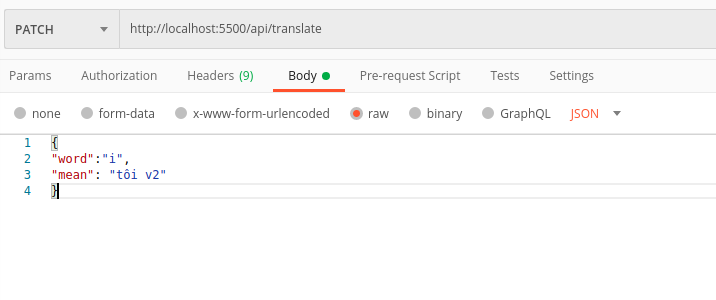
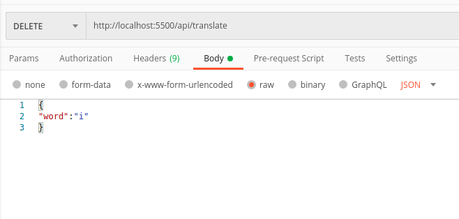

# express_api_example
express api đơn giản gồm có 2 endpoint: `/api/transtate` và `/api/calculator`

`/api/transtate` gồn các thao tác CURL dùng để thêm xóa sửa 1 từ điển trong dictionary.

`/api/calculator` dùng để tính toán verify 1 chuỗi số ISBN hợp lệ. Chi tiết thuật toán ở [đây](https://en.wikipedia.org/wiki/International_Standard_Book_Number)

## run api
```npm start or yarn start```


## run some test case api
```npm test or yarn test```

## mô tả cách sử dụng api
### `/api/transtate`

* phương thức `get` cần truyền thêm `query params word=` để lấy ý nghĩa của từ cần dịch. vd `localhost:5500/api/translate?word=second` request này sẽ resqonse như sau:
```javascript
{
    "msg": "sucessfully",
    "item": {
        "word": "second",
        "mean": "giây"
    },
    "err": 0
}
```
trong đó trường `err` tường ứng với mã lỗi của api (không phải mã lỗi http) bằng `0` tức không có lỗi. ngoài ra có các loại lỗi sau:
```javascript
const success = 0
const failure = -1 // nếu từ không có trong dictionary
const invalidParams = -2 // nếu không có query params word
```
trong đó trường `msg` cho biết message lỗi tương ứng với error code
trường `item.word` chính là từ cần dịch.`item.mean` là nghĩa của từ đó.
* phương thức `post` cần truyền thêm body dùng để thêm từ cần dịch vào dictionary. vd:


request này sẽ resqonse như sau:
```javascript
{
    "msg": "sucessfully",
    "item": {
        "word": "i",
        "mean": "tôi"
    },
    "err": 0
}
```
trong đó trường `err` bằng `0` tức không có lỗi. ngoài ra có các loại lỗi sau:
```javascript
const success = 0
const failure = -1 // nếu không ghi (persistent) xuống được database
const invalidParams = -2 // nếu không có 2 params word và mean trong body
```
trong đó trường `msg` cho biết message lỗi tương ứng với error code
trường `item` chính là record mới được thêm vào db.
* phương thức `patch` cũng cần truyền thêm body dùng để cập nhật từ cần dịch vào dictionary. vd:


request này sẽ resqonse như sau:
```javascript
{
    "msg": "sucessfully",
    "item": {
        "word": "i",
        "mean": "tôi v2"
    },
    "err": 0
}
```
trong đó trường `err` bằng `0` tức không có lỗi. ngoài ra có các loại lỗi sau:
```javascript
const success = 0 
const failure = -1 // nếu không ghi (persistent) xuống được database
const invalidParams = -2 // nếu không có 2 params word và mean trong body hoặc nếu từ cần cập nhật không có trong database
```
trong đó trường `msg` cho biết message lỗi tương ứng với error code
trường `item` chính là record mới được cập nhật vào db.
* phương thức `delete` cũng cần truyền thêm body dùng để cập nhật từ cần dịch vào dictionary. vd


request này sẽ resqonse như sau:
```javascript
{
    "msg": "sucessfully",
    "item": {
        "word": "i",
        "mean": "tôi v2"
    },
    "err": 0
}
```
trong đó trường `err` bằng `0` tức không có lỗi. ngoài ra có các loại lỗi sau:
```javascript
const success = 0 
const failure = -1 // nếu không ghi (persistent) xuống được database
const invalidParams = -2 // nếu không có params word trong body hoặc nếu từ cần xóa không có trong database
```
trong đó trường `msg` cho biết message lỗi tương ứng với error code
trường `item` chính là record mới được xóa từ db.

### `/api/calculator`